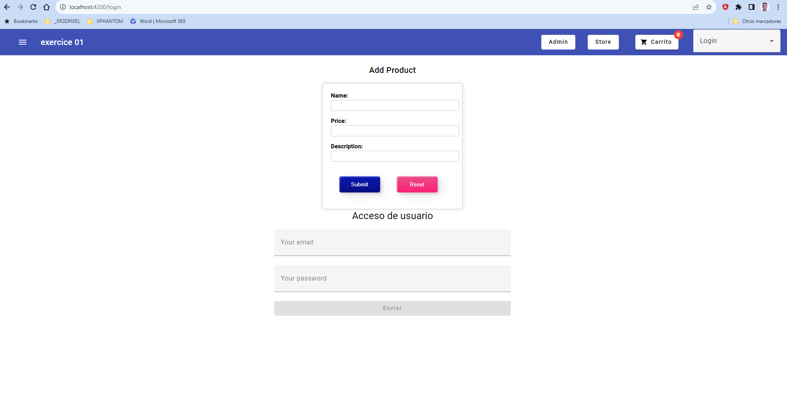
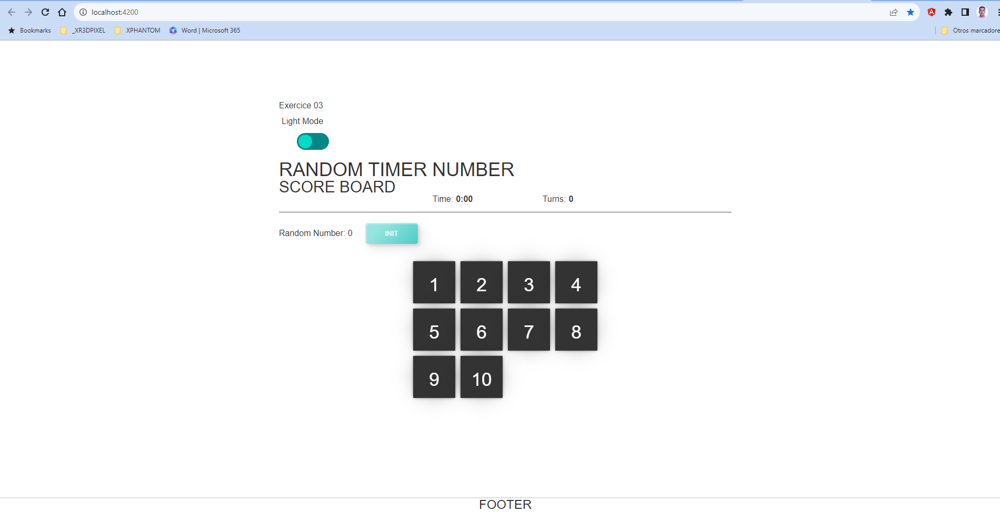

# GOLDEN RACE FRONTEND TEST 

## INSTRUCTIONS

This is an Angular Workspace with 4 applications, each of them is an exercise.

Complete all the exercises and upload the project to a Git server and give us access or send us the project zipped.

Install the dependencies as usual and run the apps with Angular CLI. For example:

`npx ng serve exercise1`

## REQUIREMENTS

- All the components, pipes, and services must have unit tests.
- CSS Frameworks or component libraries are not allowed.
- External dependencies like NPM packages, fonts, styles or scripts from CDNs are not allowed.
- The application must not throw unhandled errors on the console.
- All the code, documentation or UI must be written in English.
- The linter must work by running `npm run lint`.
- The build must work by running `npm run build`
- All the tests must pass by running `npm run test`

## THINGS WE VALUE

- Strongly typed code
- Documentation and well commented code
- The fewer external dependencies the better
- Angular forms and validators usage
- Prettier usage
- Advanced RxJS usage
- SCSS Variables or CSS Custom Properties usage
- CSS Flex or Grid usage
- Git usage


## EXERCICE_01

### REQUIREMENTS EXERCISE 1

- Create a componet with reactive form with two fields for product "name" and "price"
- The price must be a number greater than 5 and less than 20
- The product name must be a string longer than 5 characters and smaller than 20
- After submitting the form, if the form is valid show a success message
- After submitting the form, if the form is invalid show the validation errors
- Hide the messages after the form reset
- Implement unit tests for the component

### FUNCTIONING

Run app in DEV MODE
console 1: postgres DB
```bash
cd exercice1/_backend
npm run docker:db:dev
```

console 2: nestJS backend
```bash
cd exercice1/_backend
npm run nest:dev
```

console 3: ng frontned
```bash
cd exercice1/_frontend
npm run ng:open
```

console 4: ng testing 
```bash
cd exercice1/_frontend
ng test
```

Run app: in TEST MODE, to run cypress tests
console 1: postgres DB
```bash
cd exercice1/_backend
npm run docker:db:test
```

console 2: nestJS backend
```bash
cd exercice1/_backend
npm run nest:test
```

console 3: ng frontned
```bash
cd exercice1/_frontend
npm run ng:open
```

console 4: e2e testing
```bash
cd exercice1/_e2e-tests
npm run cypress:open
```

### MORE INFO ABOUT DEVELOPMENT

[more info](./documentation/exercice_01/explainning-development.md)




## EXERCISE 2

- Create a new module with a component called "lazy"
- Use routing to lazy load the module and show the component when the route is "/lazy"
- Create a new module with a component called "secure"
- Use routing to lazy load the module and show the component when the route is "/secure"
- Use routing to protect "/secure" route and never let the user load it
- Add two navigation links on the AppComponent to test both routes

### FUNCTIONING
ng serve --open
```bash
cd exercice_02
npm run start
```

ng build
```bash
cd exercice_02
npm run build
```
others scripts
```js
  scripts: [
    "watch": "ng build --watch --configuration development",
    "test": "ng test",
    "test:coverage": "ng test --code-coverage"
  ]
```

### MORE INFO ABOUT DEVELOPMENT
[more info](./documentation/exercice_02/explainning-development.md)


## EXERCISE 3

- Modify the DataService getNumbers method to return a random integer number between 0 and 10, once per second
- Implement unit tests for the service
- Modify the AppComponent to show the last number emitted by the service and update it every time it changes
- Implement unit tests for the component

### FUNCTIONING

ng serve --open
```bash
cd exercice_03
npm run start
```

ng build
```bash
cd exercice_03
npm run build
```
others scripts
```js
  scripts: [
    "watch": "ng build --watch --configuration development",
    "test": "ng test"
  ]
```
### MORE INFO ABOUT DEVELOPMENT
[more info exercice 03](./documentation/exercice_03/explainning-development-e3.md)




## EXERCISE 4

- Transform the AppComponent to match the attached image by using flex or grid
- No CSS frameworks or external dependencies are allowed
- The result must be responsive
- When the viewport width is bigger than 900px, center the content
- When the viewport width is smaller than 400px, print all the elements stacked in the following order: Header, Sidebar, Featured, A, B


### FUNCTIONING

ng serve --open
```bash
cd exercice_03
npm run start
```

ng build
```bash
cd exercice_03
npm run build
```
others scripts
```js
  scripts: [
    "watch": "ng build --watch --configuration development",
    "test": "ng test"
  ]
```

### MORE INFO ABOUT DEVELOPMENT
[more info exercice 04](./documentation/exercice_04/explainning-development-e4.md)


### SOLID PRINCIPLES APPLICATED IN NG PROJECT
1. Single Responsibility Principle (SRP):

Components: Angular components should have a single responsibility. They should handle the presentation and specific view logic. Any additional logic should be moved to services.

2. Open/Closed Principle (OCP):

Directives and Pipes: In Angular, you can extend existing directives and pipes to add additional functionality without modifying the original source code. This follows the "open for extension, closed for modification" principle.

3. Liskov Substitution Principle (LSP):

Inheritance and Polymorphism: In TypeScript, which is the primary language of Angular, you can apply the Liskov principle by using inheritance and polymorphism. This means that subclasses should be able to replace their base classes without changing the expected behavior.

4. Interface Segregation Principle (ISP):

Interfaces: Angular uses interfaces to define the structure that a class or component should follow. Interfaces should be small and specific to avoid unnecessary implementation of unused methods or properties.

5. Dependency Inversion Principle (DIP):

Dependency Injection (DI): Angular promotes dependency inversion through its dependency injection system. Angular components and services should depend on abstractions rather than concrete implementations. This allows for flexibility and facilitates unit testing.

6. Other SOLID Principles:

6. 1.  Composite Principle: Angular favors the composition of components and services to build applications. Components can be composed and reused easily throughout the application.

6. 2. Separation of Concerns: Angular encourages the separation of concerns by using components to separate presentation logic from business logic. Services are used to handle business logic in isolation.

// TODO todo esto de abajao
### GIT WORKFLOW
Using Git Flow is beneficial because it provides a structured workflow for managing Git repositories. It helps streamline collaboration, improve code quality, and maintain a clear version history, making it easier to work on projects with multiple developers and releases.

       /--(feature)----(feature)--\
      /                            \
---(master)----(release)-------(hotfix)---


In this schema:

Master: Represents the main branch of the project, where the latest stable version of the code resides.

Feature: Branches created to develop new features or functionalities. They are merged back into the "develop" branch when complete.

Release: Branches used to prepare a new software version for release. Final testing and bug fixes are done here before merging with "master" and "develop."

Hotfix: Branches created to address critical issues or errors in the current production version. They are merged with "master" and "develop" once resolved.

This is just an example of a possible branch structure using Git Flow. It can be customized according to your project's needs.

### DOCKERIZATION
Using Dockerization in development is beneficial because it provides:

1. **Consistency:** Docker ensures that your application runs consistently across different environments, preventing the "it works on my machine" problem.

2. **Isolation:** Docker containers encapsulate dependencies and libraries, eliminating conflicts and ensuring a clean development environment.

3. **Portability:** Docker images can be easily shared and deployed across various platforms and cloud providers, making it straightforward to move applications between different infrastructure.

4. **Efficiency:** Docker allows for resource-efficient deployment, scaling, and management of applications, reducing infrastructure costs.

5. **Reproducibility:** Developers can reproduce the exact environment, which leads to more predictable and reliable software development and testing.

6. **Version Control:** Docker images can be versioned, allowing you to track changes and roll back to previous states if issues arise.

Overall, Dockerization streamlines the development process, improves collaboration, and enhances the reliability and scalability of applications.

I use only in the first proyect to Starting a service with th Database with postgreSQL

### TESTING
The task involved conducting unit tests in Angular and end-to-end tests using Cypress. The benefits of conducting tests are:

Early Error Detection: Tests identify issues in the early stages of development, making it easier to correct them before they impact the final product.

Maintainability: Tests facilitate the identification of problems when making code changes, helping to maintain software integrity.

Code Confidence: Tests instill confidence that the code functions as expected, which is crucial for the success of any project.

Living Documentation: Tests act as living documentation, providing clear examples of how the code is supposed to function.

Enhanced Collaboration: Tests enable better collaboration among development teams by establishing clear performance criteria.

Long-Term Time Savings: While writing tests may take time, they save time in debugging and long-term maintenance.

In summary, the work focused on the significance of testing to ensure software quality and expedite the development process.

It's true that development initially becomes slower, especially as I've noticed in these exercises that, while not difficult, took me more than double the usual time. However, in the long run, any development becomes more time-efficient thanks to test automation. The next step will be implementing TDD (Test-Driven Development)

### TDD
Advantages of TDD:

Early bug detection.
Improved code quality.
Enhanced code maintainability.
Faster development in the long term.
Increased confidence in code.
Disadvantages of TDD:

Initial slower development pace.
Time-consuming.
May require a mindset shift.
Not suitable for all projects.
May lead to over-engineering.

Yo para estos ejercicios no he usado esta ténica, pero si lo he realizado en otros proyectos, con RICOH.es

### SCRUM
Scrum is an agile project management framework that focuses on collaboration, flexibility, and customer feedback. It divides work into time-boxed iterations called sprints, typically lasting 2-4 weeks. Scrum promotes cross-functional teams, daily stand-up meetings, and the use of backlogs to prioritize work. It emphasizes adaptability, transparency, and regular inspection and adaptation of the product. Scrum helps organizations deliver value quickly and respond effectively to changing requirements.

In both Scrum and Extreme Programming (XP), there are advantages and disadvantages.

**Advantages:**

1. **Collaboration:** Both methodologies promote close collaboration among team members and stakeholders, leading to better communication and shared understanding.

2. **Customer Focus:** Both Scrum and XP prioritize customer feedback and deliver incremental value to customers regularly.

3. **Flexibility:** They are adaptable to changing requirements, allowing teams to respond to customer needs effectively.

4. **Quality Assurance:** Both methodologies emphasize the importance of quality through practices like testing and continuous integration.

**Disadvantages:**

1. **Complexity:** Implementing Scrum or XP can be complex and require significant changes in organizational culture and processes.

2. **Learning Curve:** Team members may need time to learn and adapt to these methodologies, potentially affecting productivity initially.

3. **Overhead:** The additional meetings and ceremonies in Scrum, or the strict practices in XP, can introduce overhead that some teams may find burdensome.

4. **Not Universally Applicable:** Scrum and XP may not be suitable for all types of projects or organizations, requiring careful consideration of their applicability.

In summary, both Scrum and XP offer benefits in terms of collaboration, customer focus, flexibility, and quality assurance, but their implementation can be challenging and may not fit every context.

### ASANA
Asana is an online work and project management platform that enables teams and organizations to plan, track, and manage tasks and projects efficiently. It offers task creation, assignment, deadline tracking, and collaboration features, enhancing productivity and project management.

### ENLACES DE INTERÉS

[portfolio](https://juanlunablanco.github.io/portfolio/#inicio)

[linkedin](https://www.linkedin.com/in/juan-manuel-luna-blanco-180a1570/)

[github](https://github.com/JUANLUNABLANCO)

[codepen](https://codepen.io/jaunluna)


## Conclusions
I have enjoyed working on these exercises, which, in the end, were not very challenging but rather lengthy due to the tests and my somewhat rusty CSS skills. However, what matters most is that I've learned some new things.

In the first exercise, even though it wasn't specifically required, I developed a backend using NestJS and set up a PostgreSQL database using Docker. Additionally, I implemented end-to-end tests with Cypress and showcased my versatility in different technologies by incorporating Angular Material. I also achieved an 85% unit test coverage.

Rest assured, no animals were harmed during the completion of these exercises—only the patience of my family members who witnessed me deeply immersed in these tasks.

I look forward to the possibility of working together in the near future. Kind regards,
Juan Luna.

