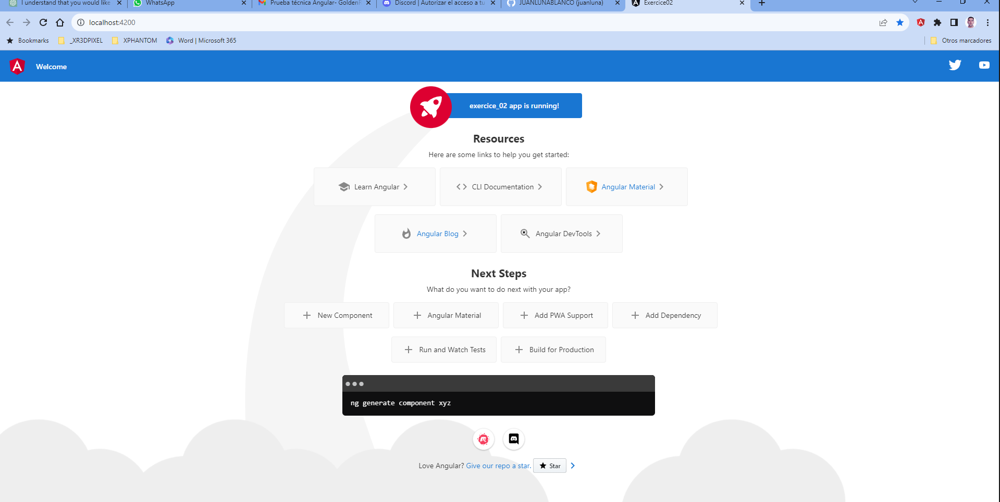
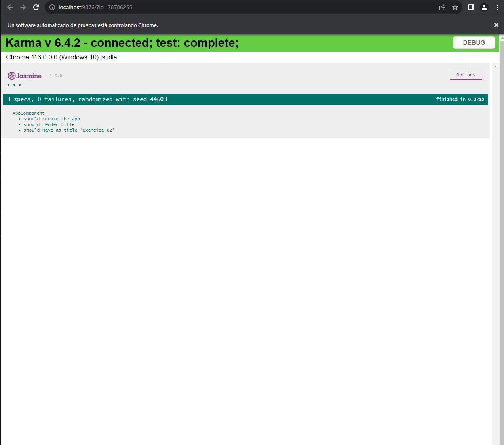
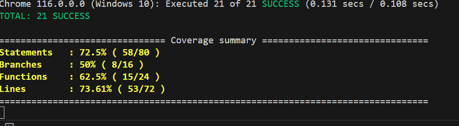
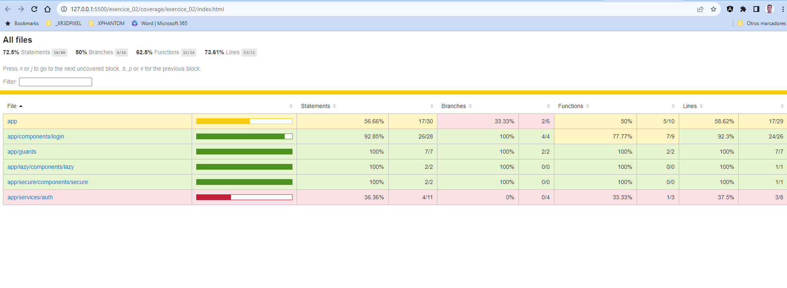
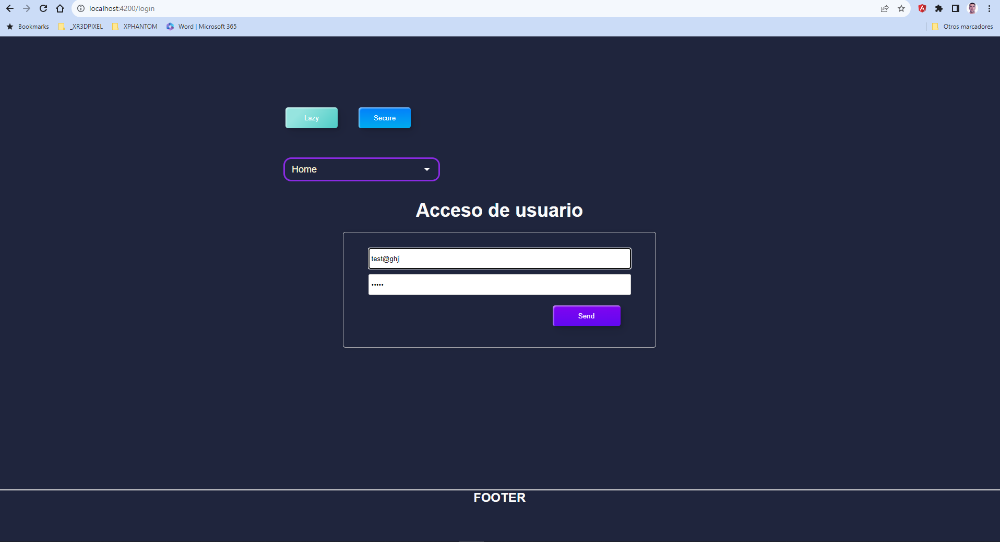

## Exercice 02

### Requirements

- Create a new module with a component called "lazy"
- Use routing to lazy load the module and show the component when the route is "/lazy"
- Create a new module with a component called "secure"
- Use routing to lazy load the module and show the component when the route is "/secure"
- Use routing to protect "/secure" route and never let the user load it
- Add two navigation links on the AppComponent to test both routes


### making the project

First I created a new app called exercice_02
```bash
ng new exercice_02
```

I executed it
```bash
ng serve --open
```

I run the tests
```bash
ng test
```
Everything it´s ok






### modules and components

```bash
ng generate module lazy --routing
ng generate component lazy/components/lazy
ng generate module secure --routing
ng generate component secure/components/secure
```

```lazy-routing.module.ts
import { NgModule } from '@angular/core';
import { Routes, RouterModule } from '@angular/router';
import { LazyComponent } from './lazy.component';

const routes: Routes = [{ path: '', component: LazyComponent }];

@NgModule({
  imports: [RouterModule.forChild(routes)],
  exports: [RouterModule],
})
export class LazyRoutingModule {}
```

```secure-routing.module.ts
import { NgModule } from '@angular/core';
import { Routes, RouterModule } from '@angular/router';
import { SecureComponent } from './secure.component';

const routes: Routes = [{ path: '', component: SecureComponent }];

@NgModule({
  imports: [RouterModule.forChild(routes)],
  exports: [RouterModule],
})
export class SecureRoutingModule {}
```

```app-routing.module.ts
import { NgModule } from '@angular/core';
import { Routes, RouterModule } from '@angular/router';

const routes: Routes = [
  { path: 'lazy', loadChildren: () => import('./lazy/lazy.module').then((m) => m.LazyModule) },
  {
    path: 'secure',
    loadChildren: () => import('./secure/secure.module').then((m) => m.SecureModule),
    canLoad: [AuthGuard], // Agrega un guardia de autenticación aquí para proteger la ruta
  },
  { path: '', redirectTo: '/lazy', pathMatch: 'full' },
];

@NgModule({
  imports: [RouterModule.forRoot(routes)],
  exports: [RouterModule],
})
export class AppRoutingModule {}
```

```bash
ng g guard core/guards/auth
```


```app.component.ts
<nav>
  <a routerLink="/lazy">Lazy</a>
  <a routerLink="/secure">Secure</a>
</nav>
<router-outlet></router-outlet>
```

## Scss
In the project, SCSS (Sass) has been employed as a CSS preprocessor to enhance style organization and reusability throughout the Angular project. Here's a summary of the key aspects of the work carried out:

SCSS Variables: SCSS variables have been defined to store reusable values, such as colors, font sizes, and other common styles across the project. This has ensured consistency in appearance and facilitated future modifications.

SCSS Mixins: SCSS mixins have been created to encapsulate common styles and enable their reuse in various components. These mixins have reduced code duplication and maintained cleaner and more maintainable code.

Structured Organization: The SCSS code has been organized into sections, including variables, resets, general styles, component-specific styles (such as headers, buttons, forms, etc.), and error message styles.

Form Validation: SCSS form validation has been implemented, displaying error messages when users interact with input fields. This is achieved by applying specific styles to invalid fields and showing corresponding error messages.

Responsive Styling: SCSS styles have been designed to be responsive and adapt to different screen sizes and devices. This has been achieved using relative measurement units like vh to control height and max-width to limit the width of certain elements.

Global Styles: Global styles in SCSS have been used in the styles.scss file to define styles that affect the entire project. This includes background styles, default fonts, and other globally applied styles.

Style Importation: To make globally defined variables and styles available in component files, SCSS file imports have been used in components that require those global styles.

English Comments: All comments in the SCSS and TypeScript files have been provided in English, following documentation and development best practices.

Collectively, the use of SCSS has improved the structure and maintenance of styles in the Angular project, providing a solid foundation for user interface design and interaction. This facilitates collaboration and ongoing project development.

## testing components, services
Certainly, here's the transcription in English:

1. Tests in SCSS Files:
Advantages:
Ensures consistency and quality of styling in your application.
Facilitates maintenance by detecting styling issues early.
Uses variables and mixins for efficient style management.

2. Tests in Angular Components:
Tests in AppComponent:
Advantages:
Checks the creation of the component.
Verifies the initialization of variables and forms.
Tests navigation and user interactions.
Uses fakeAsync and tick to control time in asynchronous tests.
Tests in LoginComponent:
Advantages:
Checks the creation of the component and form initialization.
Validates login logic and success/error messages.
Uses fakeAsync and tick to control time in asynchronous tests.

3. Angular Guard Testing:
Tests in AuthGuard:
Advantages:
Verifies if the guard is created correctly.
Checks if it allows navigation for authenticated users.
Validates that it blocks navigation and redirects to the login page for non-authenticated users.

4. Summary of Techniques Used:
Unit Testing: Unit tests were conducted for individual components and guards, allowing verification of the isolated behavior of each.

Spy: spyOn was used to simulate and control the behavior of methods and functions, facilitating the simulation of interactions and events in tests.

Dependency Injection: Angular's dependency injection was employed through TestBed.inject to provide instances of services and components needed in the tests.

fakeAsync and tick: fakeAsync and tick were used to handle tests with asynchronous operations and timers, allowing control over the execution time of events.

Router Testing: RouterTestingModule was used to enable routing tests and verify redirects in guards.

Angular Testing Utilities: Testing utilities provided by Angular, such as TestBed and ComponentFixture, were leveraged to configure and run tests effectively.

These tests are essential to ensure that your Angular application functions correctly and meets quality requirements. They also help maintain confidence in the code as development and updates occur.

### Coverage
To perform a test coverage analysis in an Angular project and ensure that I have conducted adequate tests in my code, I will use tools like 'Istanbul' and 'Karma,' which are widely used in the Angular ecosystem. Below, I provide the general steps to set up and run a test coverage analysis in Angular:

1. **Configure Karma and Jasmine:** Ensure that you have already set up unit tests in your Angular project using Karma and Jasmine. If you haven't done so yet, you can configure them by following Angular's guides.

2. **Install Istanbul:** You need to install the 'Istanbul' tool, which is used for code coverage analysis. You can do this using npm with the following command:

   ```
   npm install --save-dev istanbul
   ```

3. **Configure Istanbul with Karma:** Configure Istanbul to integrate with Karma. To do this, you can execute the following CLI command:

   ```bash
   ng generate config karma
   ```

   This will generate the 'karma.conf.js' file.

4. **Run Tests with Coverage:** Now, you can run your unit tests with code coverage. To do this, simply run the following command:

   ```
   ng test --code-coverage
   ```

   This will initiate the unit tests and generate a coverage report in the 'coverage' folder of your project.

5. **Analyze the Coverage Report:** After running the tests, you can open the generated coverage report in your web browser. Navigate to the 'coverage' folder and open the 'index.html' file in your web browser. This report will show you which parts of your code are covered by tests and which are not.

6. **Add Missing Tests:** If you find areas of your code that are not covered by tests, you should write additional tests for those areas and then repeat the coverage analysis process.

With these steps, you can perform a test coverage analysis in your Angular project and ensure that all critical parts of your code are properly tested. This will help improve the quality and reliability of your application.



As it turns out, the tests conducted only reached 73.62%. We observed the page in the 'coverage' folder to identify missing tests for the 'app/services/auth' component.



Thanks to the tests, we identified an error that would have been overlooked. Since the login is fake and does not perform database checks, the following tests were failing:

```typescript
it('should return false when email is missing', () => {
    const password = 'test123';

    const result = service.login(null, password);

    expect(result).toBeFalse();
  });

it('should return false when password is missing', () => {
    const email = 'test@gmail.com';

    const result = service.login(email, null);
});
```

It turned out that these tests were failing because 'null' was not accepted, given that the `auth.login()` function was designed as follows:

```typescript
// auth.service
login(email: string, password: string) {
    if (!email && password) return false;
    localStorage.setItem('auth', 'ok');
    return true;
}
```

The tests were failing because it only accepted strings. After changing the code, everything worked correctly:

```typescript
// auth.service
login(email: string | null, password: string | null) {
    if (!email || !password) return false;
    localStorage.setItem('auth', 'ok');
    return true;
}
```

Next, let's rerun the coverage analysis to see the new test coverage percentage:

```bash
ng test --code-coverage
```

Now, we have achieved an 80% coverage, which is excellent.


## Time spent on the development of this exercise.

code ng 5H  
test ng 6H  (coverage 80%)
scss    7H  (without relying on frameworks.)
others  2H  
__________
Total   20 H

## finish


## conclusions
The exercise is not complicated; it's just that we know that if we want to create applications that are easily maintainable, scalable, etc., we need to follow design patterns, SOLID principles, etc. And that involves more time and more files, even for simple tasks, but of high quality.

A lot of HTML and CSS that I didn't remember because I've been using Angular Material lately.

But often, it's good to detach from those frameworks to challenge our thinking, have fewer development dependencies, reduce overhead, and perhaps, as a drawback, the time spent on doing something without that assistance is greater.


