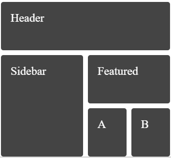
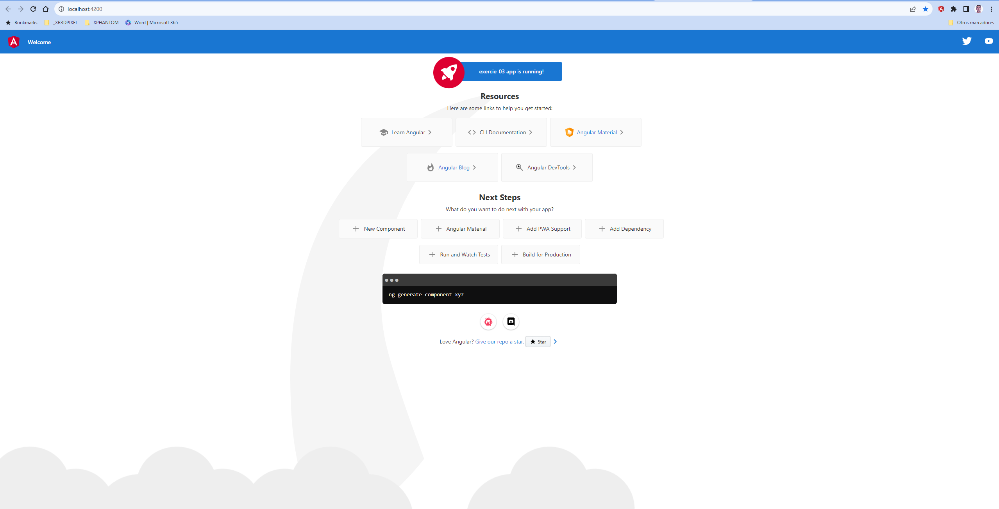
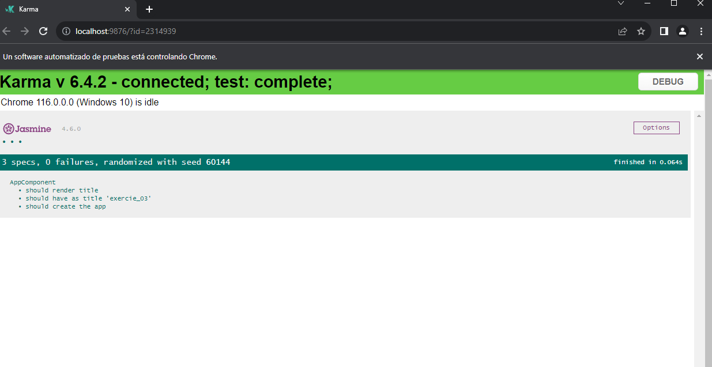
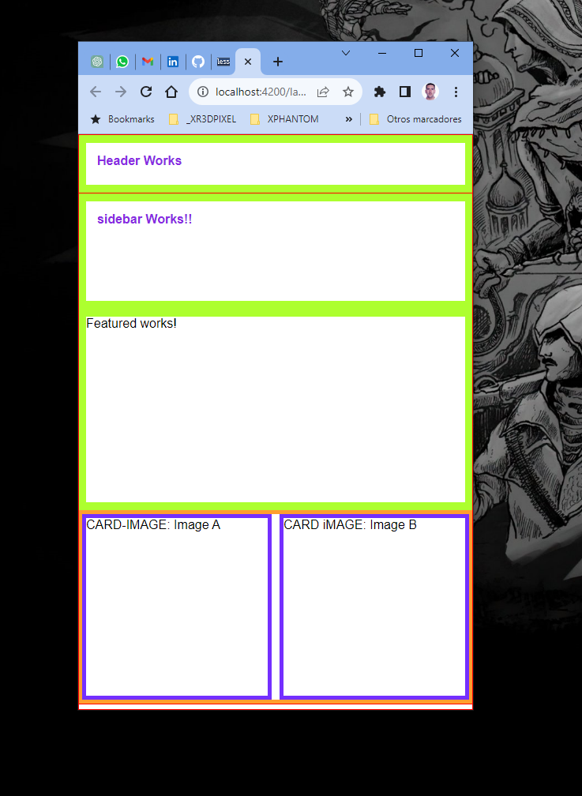
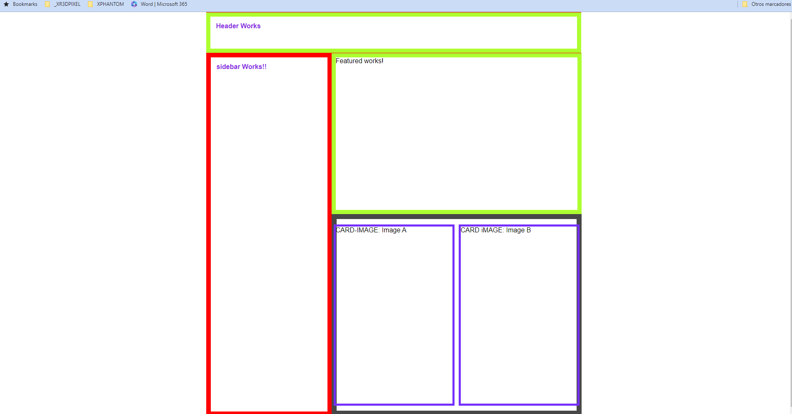

## Exercice 04

### Requirements
- Transform the AppComponent to match the attached image by using flex or grid
- No CSS frameworks or external dependencies are allowed
- The result must be responsive
- When the viewport width is bigger than 900px, center the content
- When the viewport width is smaller than 400px, print all the elements stacked in the following order: Header, Sidebar, Featured, A, B



### making the project

First I created a new app called exercice_02
```bash
ng new exercice_04
cd exercice_04
```

I executed it
```bash
npm run start
```

build it
```bash
npm run build
```

I run the tests
```bash
npm run test
```
run test coverage
```bash
npm run test:coverage
```

Everything it´s ok






### scafolding

I follow this steps to make an angular project with th stablished conditions:
**Step 1: Create a new Angular project**

I run the following command to create a new Angular project named "exercise_03" using Angular CLI:
```bash
ng new exercise_04 --style=less
```

This command will create the initial project structure with LESS as the stylesheet format.

**Step 2: Navigate to the project folder**

Change your current directory to the newly created project folder:
```bash
cd exercise_04
```

**Step 3: Generate components, modules, services, etc.**

Now, we'll generate the necessary components, modules, services, and other files as required. Below are the commands to generate each of them:

```bash
ng g c layout
```

base structure of the html
```html
<div class="container">
  <header class="header">Header</header>
  <aside class="sidebar">Sidebar</aside>
  <main class="main">
    <section class="featured">Featured</section>
    <section class="articles">
      <article class="image-a">Image A</article>
      <article class="image-b">Image B</article>
    </section>
  </main>
</div>
```

others components
```bash
# the header inside the layout
ng g c layout/components/header

# the aside inside the layout
ng g c layout/components/sidebar

# main inside the layout
ng g c layout/components/main

# featured inside the layout
ng g c layout/components/featured

# articles inside the layout
ng g c layout/components/articles

# card-image in shared
ng g c shared/card-image
```

At the end the structure with components, should be like this

```html
<app-root>
  <div class="container">
    <app-header class=header>Header</app-header>
    <aside class="sidebar">
      <app-sidebar>Sidebar</app-sidebar>
    </aside>
    <main class="main">
      <app-main>
        <section class="featured">
          <app-featured></app-featured>
        </section>
        <section class="articles">
          <app-articles>
            <article>
              <app-card-image>Image A</app-card-image>
            </article>
            <article>
              <app-card-image>Image B</app-card-image>
            </article>
          </app-article>
        </section>
      </app-main>
    </main>
  </div>
</app-root>
```

In the end, the layout, so that the components are properly absorbed by the layout, will look like this.

```html
<div class="container">
  <app-header>Header Works</app-header>
  <!-- <main class="main"> -->
    <app-main>
      <!-- Main Works!! -->
      <!-- <aside class="sidebar"> -->
        <app-sidebar>
          sidebar Works!!
        </app-sidebar>
  <!-- </aside> -->
      <div class="right-content" > 
        <!-- Right content -->
        <!-- <section class="featured"> -->

          <app-featured>Featured works!</app-featured>
        <!-- </section> -->
        <!-- <section class="articles"> -->
          <app-articles>
            <!-- Articles Works -->
            <!-- <article class="card-image"> -->
              <app-card-image>CARD-IMAGE: Image A</app-card-image>
            <!-- </article> -->
            <!-- <article> -->
              <app-card-image>CARD iMAGE: Image B</app-card-image>
            <!-- </article> -->
          </app-articles>
        <!-- </section> -->
      </div>
    </app-main>
  <!-- </main> -->
</div>
```

In this way we can take advantage of the semantics of HTML tags, important for SEO and also all the advantages that the development of components from Angular gives us, separating the logic of each of them.

And all the commented-out code is absorbed by the component as follows:

```html
<main class="main">
  <ng-content></ng-content>
</main>
```

**Step 4: Run the application**

You can now run the Angular application using the following command:

```bash
ng serve
```

The application will be available at `http://localhost:4200`. You can access it in your web browser.

Please note that this is a high-level overview of the steps. You will need to implement the details and styling according to your project's requirements.

## Estimated hours
ng      1h
css     2h
browser 1h
__________
total   4h
## finish exercice_04





